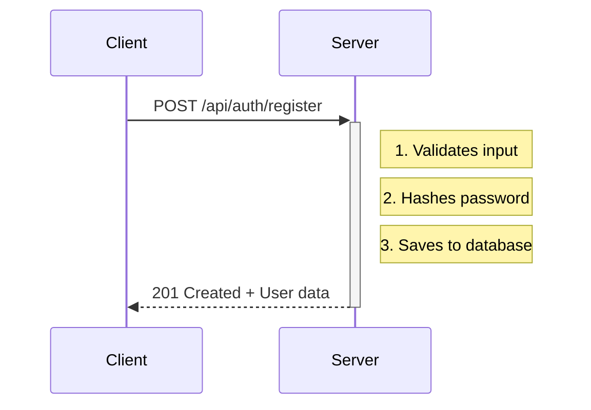
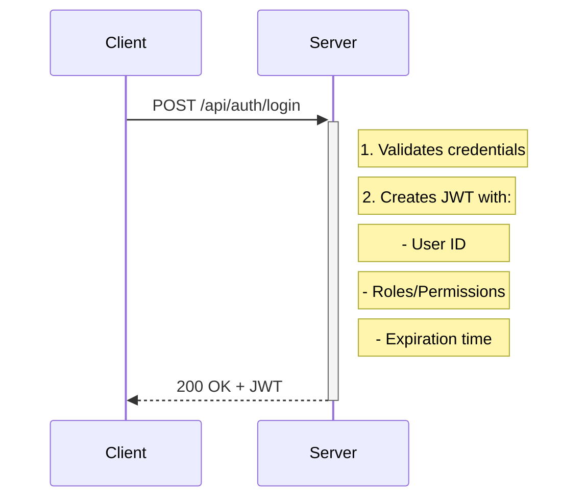
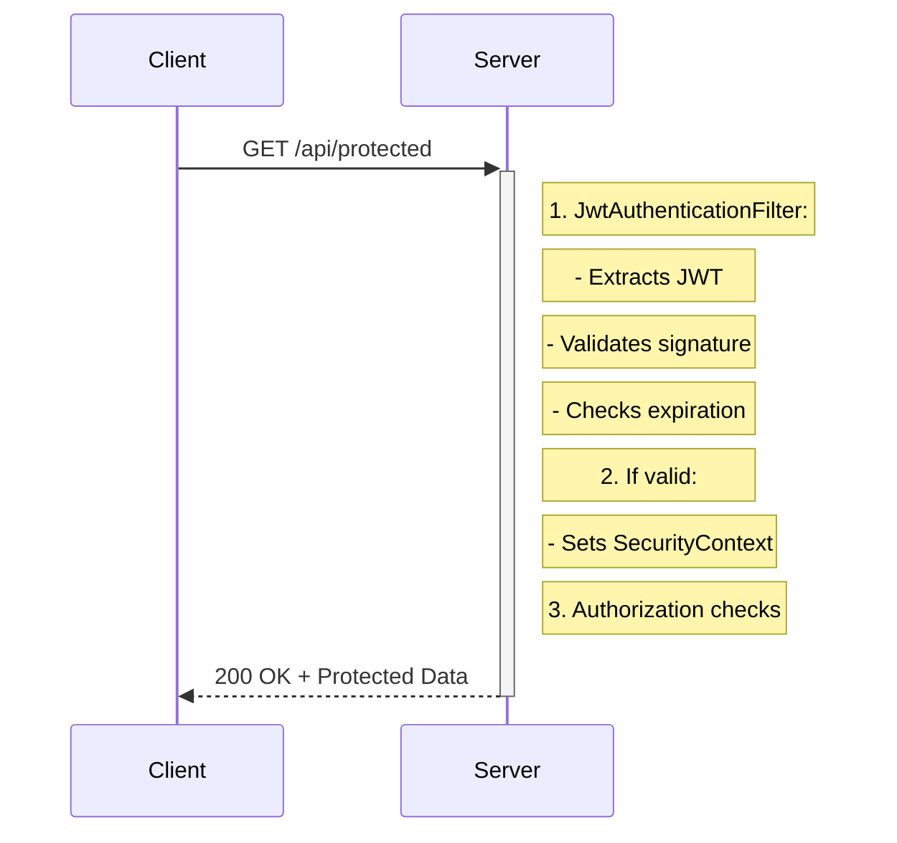

# Authentication & Authorization Guide with JWT

## 1. Core Concepts

### Authentication (AuthN)
- **What**: Verifying "Who are you?"
- **How**: Validates user credentials (username/password)
- **When**: During login and every subsequent request
- **Example**: Logging in with email and password

### Authorization (AuthZ)
- **What**: Verifying "What can you do?"
- **How**: Checks user roles/permissions to grant/deny access to resources
- **When**: After authentication, for each protected resource
- **Example**: Checking if user has 'ADMIN' role to access admin panel

## 2. Complete Flow

### A. Registration (One-time)


### B. Login (Authentication)


### C. Accessing Protected Resources


## 3. JWT Structure
```json
{
  "sub": "user123",
  "username": "john.doe",
  "roles": ["ROLE_USER"],
  "iat": 1632456789,
  "exp": 1632460389
}
```

## 4. Spring Security Components

### Key Classes

#### UserDetailsService
- Loads user-specific data
- Must be implemented by your application

#### UserDetails
- Represents authenticated user
- Contains username, password, authorities

#### AuthenticationManager
- Processes authentication requests
- Delegates to AuthenticationProvider

#### JwtUtils
- Generates/validates JWT tokens
- Extracts user information

## 5. Security Configuration

```java
@Configuration
@EnableWebSecurity
public class SecurityConfig {
    @Bean
    public SecurityFilterChain securityFilterChain(HttpSecurity http) throws Exception {
        http
            .csrf().disable()
            .authorizeHttpRequests(auth -> auth
                .requestMatchers("/api/auth/**").permitAll()
                .anyRequest().authenticated()
            )
            .addFilterBefore(jwtAuthenticationFilter, 
                UsernamePasswordAuthenticationFilter.class);
        return http.build();
    }
}
```

## 6. Best Practices

### JWT
- Use strong signing key
- Set reasonable expiration time (15-60 minutes for access tokens)
- Store securely on client (HTTP-only cookie recommended)
- Implement refresh token rotation

### Passwords
- Always hash with BCrypt
- Never store plain text
- Enforce strong password policies
- Consider password strength meters

### HTTPS
- Always use in production
- Enforce HTTPS in Spring Security
- Use HSTS headers

### Rate Limiting
- Implement on login endpoints
- Consider IP-based rate limiting
- Log and monitor failed attempts

## 7. Common Vulnerabilities & Mitigations

### XSS (Cross-Site Scripting)
- **Risk**: Malicious scripts execution
- **Mitigation**:
  - Use HTTP-only cookies
  - Implement Content Security Policy (CSP)
  - Sanitize all user inputs

### CSRF (Cross-Site Request Forgery)
- **Risk**: Unauthorized actions on behalf of user
- **Mitigation**:
  - Use CSRF tokens for stateful apps
  - Disable CSRF for stateless JWT APIs
  - Use SameSite cookie attribute

### Token Theft
- **Risk**: Unauthorized access using stolen tokens
- **Mitigation**:
  - Short expiration times
  - Implement token blacklisting
  - Use refresh token rotation

## 8. Example Protected Endpoints

```java
@RestController
@RequestMapping("/api/users")
public class UserController {
    
    // Accessible to any authenticated user
    @GetMapping("/me")
    @PreAuthorize("isAuthenticated()")
    public ResponseEntity<UserProfile> getMyProfile() {
        Authentication auth = SecurityContextHolder.getContext().getAuthentication();
        String username = auth.getName();
        // Return user profile
    }
    
    // Accessible only to users with ROLE_ADMIN
    @DeleteMapping("/{id}")
    @PreAuthorize("hasRole('ADMIN')")
    public ResponseEntity<?> deleteUser(@PathVariable Long id) {
        // Admin-only operation
    }
    
    // More granular permission check
    @PutMapping("/{id}/role")
    @PreAuthorize("hasRole('ADMIN') and #id != authentication.principal.id")
    public ResponseEntity<?> updateRole(@PathVariable Long id, 
                                      @RequestBody RoleUpdateRequest request) {
        // Prevent self-role modification
    }
}
```

## 9. Token Refresh Flow

### Client-Side Storage
```javascript
{
  "accessToken": "eyJhbGciOi...",
  "refreshToken": "eyJhbGciOi...",
  "expiresIn": 3600
}
```

### Refresh Token Endpoint
```java
@PostMapping("/auth/refresh")
public ResponseEntity<?> refreshToken(@Valid @RequestBody TokenRefreshRequest request) {
    String requestRefreshToken = request.getRefreshToken();
    
    return refreshTokenService.findByToken(requestRefreshToken)
        .map(refreshTokenService::verifyExpiration)
        .map(RefreshToken::getUser)
        .map(user -> {
            String token = jwtUtils.generateTokenFromUsername(user.getUsername());
            return ResponseEntity.ok(new TokenRefreshResponse(token, requestRefreshToken));
        })
        .orElseThrow(() -> new TokenRefreshException(
            requestRefreshToken, "Refresh token is not in database!"));
}
```

## 10. Monitoring and Logging

### Recommended Logs
- Failed login attempts
- Token refresh requests
- Role changes
- Suspicious activities

### Audit Logs Example
```java
@Aspect
@Component
public class SecurityAuditAspect {
    private static final Logger logger = LoggerFactory.getLogger(SecurityAuditAspect.class);
    
    @AfterReturning(
        pointcut = "execution(* com.yourpackage.security.jwt.AuthController.*(..))",
        returning = "result"
    )
    public void auditAuthentication(JoinPoint joinPoint, Object result) {
        // Log authentication events
    }
}
```

## 11. Testing Security

### Unit Tests
- Test authentication logic
- Test authorization rules
- Test token generation/validation

### Integration Tests
```java
@SpringBootTest
@AutoConfigureMockMvc
class AuthControllerIntegrationTest {
    
    @Autowired
    private MockMvc mockMvc;
    
    @Test
    void testAuthenticateUser() throws Exception {
        LoginRequest loginRequest = new LoginRequest("user", "password");
        
        mockMvc.perform(post("/api/auth/signin")
                .contentType(MediaType.APPLICATION_JSON)
                .content(asJsonString(loginRequest)))
                .andExpect(status().isOk())
                .andExpect(jsonPath("$.token").exists());
    }
}
```

## 12. Production Checklist

- [ ] Change default JWT secret
- [ ] Set proper token expiration times
- [ ] Enable HTTPS
- [ ] Configure CORS properly
- [ ] Set up monitoring and alerts
- [ ] Implement rate limiting
- [ ] Test security configurations
- [ ] Document API security requirements
